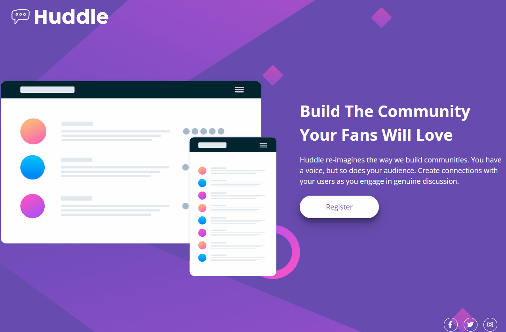

# Frontend Mentor - Huddle landing page with single introductory section solution

Desafio básico do Frontend Mentor para testar minhas habilidades com HTML e CSS.

### Desafios

- Site responsivo para os usuários, se adaptando aos diferentes dispositivos;
- Interações dos ícones ao passar o mouse por eles.

### Screenshot

### Link

- Minha solução: [https://wolfrand.github.io/huddle-landing-page/]

## Processo

### Feito com

- Semantic HTML5 markup
- CSS custom properties
- Flexbox
- Desktop-first workflow
- Clean code